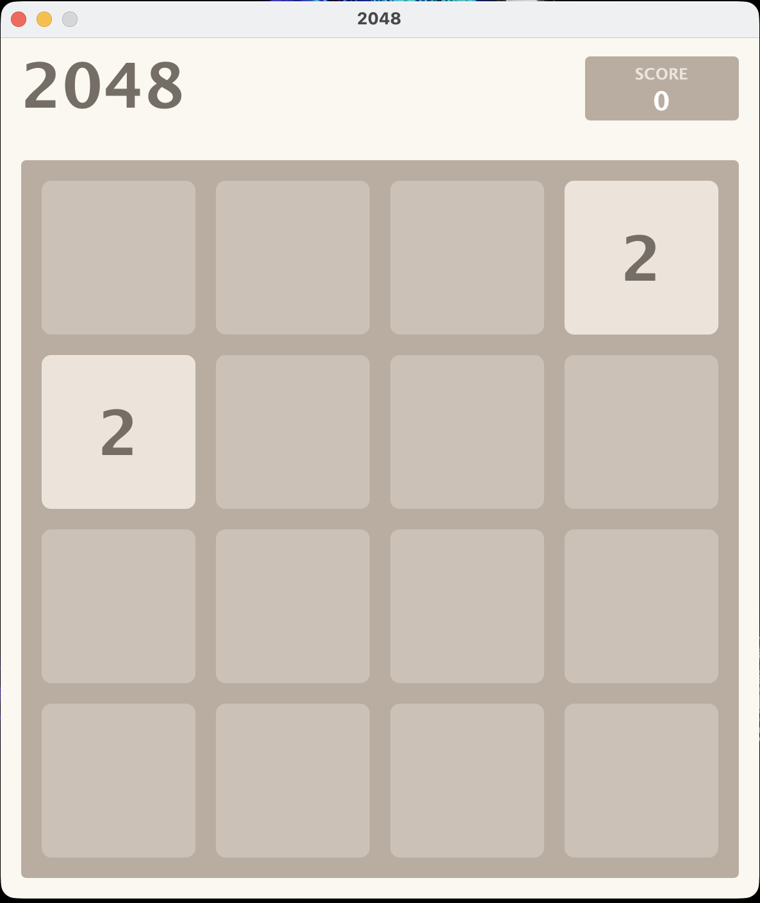
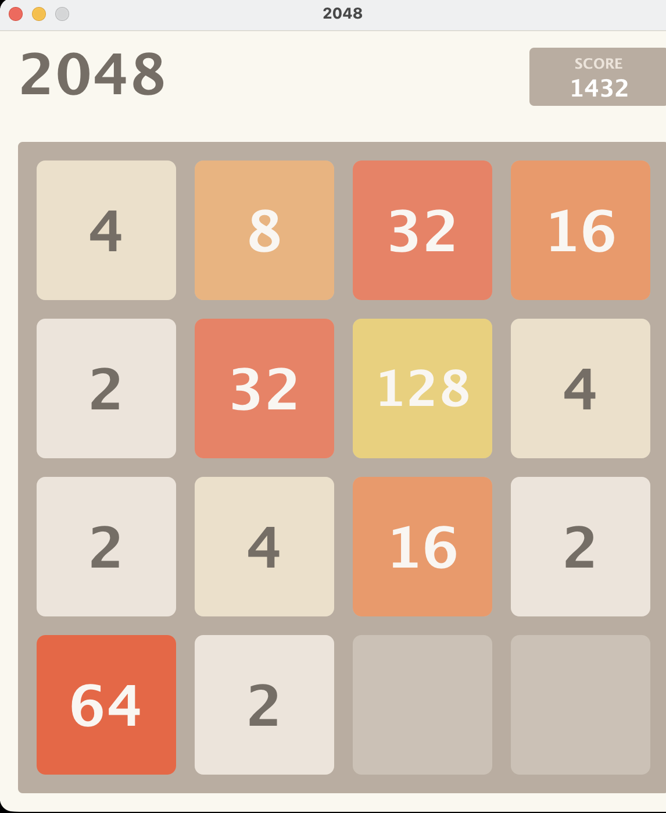
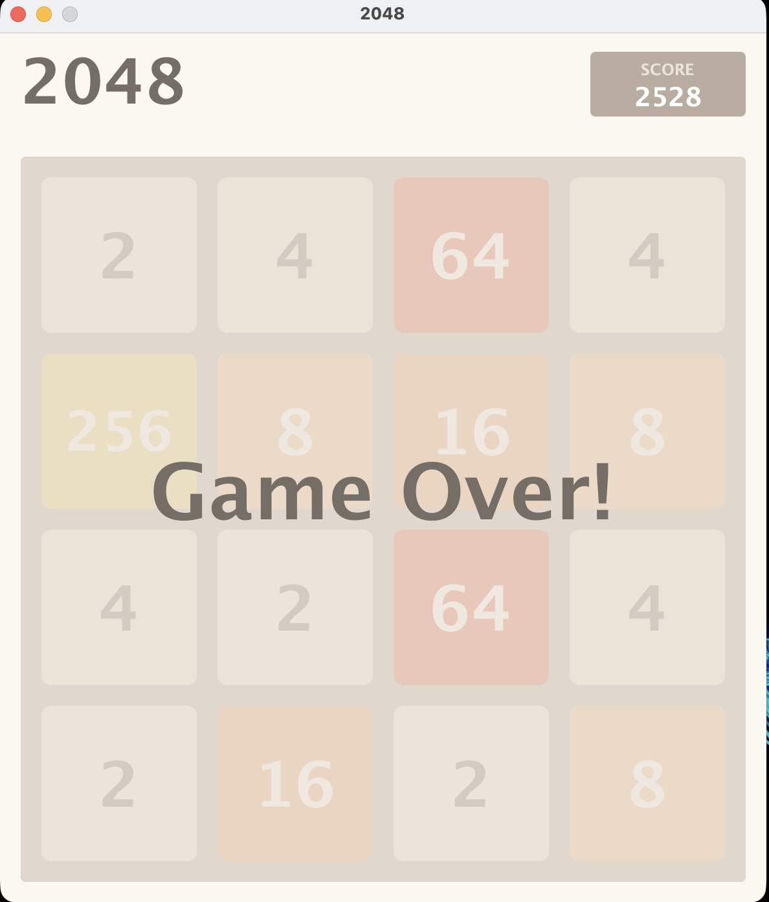

# 2048

A Java Swing implementation of the classic 2048 game with smooth animations and an intuitive interface.

## Screenshots

### Game Start


### During Gameplay


### Game Over


## Gameplay Demo

<video src="resources/gameplay.webm" controls autoplay loop muted></video>


## Features

- Smooth tile animations with easing functions
- Dynamic font sizing for larger numbers
- Score tracking system
- Clean, modern UI matching the classic 2048 design
- Game over detection and display
- AI Autoplay using Expectimax algorithm with advanced heuristics

## How to Run

1. Compile the project:
   ```bash
   javac -d out src/core/*.java src/ui/*.java src/Main.java
   ```

2. Run the game:
   ```bash
   java -cp out Main
   ```

## How to Play

### Manual Play
- Use arrow keys to slide tiles in four directions
- Tiles with the same number merge when they collide
- Each merge adds the new tile value to your score
- The goal is to create a tile with the number 2048

### AI Autoplay
- The game includes an AI player using the Expectimax algorithm
- The AI uses advanced heuristics including:
  - Snake pattern positioning (keeps high tiles in corners)
  - Monotonicity (maintains tile order)
  - Smoothness (minimizes differences between adjacent tiles)
  - Empty cell maximization
- Watch the AI play by calling `toggleAutoPlay()` on the GamePanel instance
- The AI typically reaches 2048 and beyond

## Game Rules

- After each move, a new tile (2 or 4) appears in a random empty spot
- The game ends when no more moves are possible
- Tiles only merge once per move

## Technical Details

### AI Implementation
The AI player uses the Expectimax algorithm with a depth of 3 levels:
- **Max nodes**: AI chooses the move that maximizes the score
- **Chance nodes**: Simulates random tile spawns (90% for 2, 10% for 4)
- **Evaluation function**: Combines multiple heuristics:
  - Position weights in snake pattern
  - Monotonicity score (tile ordering)
  - Smoothness score (adjacent tile similarity)
  - Empty cell bonus (exponential reward)
  - Corner bonus (keeps max tile in corner)

### Project Structure
```
src/
├── core/
│   ├── GameLogic.java    # Game rules and board state
│   ├── Tile.java          # Individual tile representation
│   └── AIPlayer.java      # Expectimax AI implementation
├── ui/
│   ├── GamePanel.java     # Main game panel with rendering
│   └── GameWindow.java    # JFrame window setup
└── Main.java              # Entry point
```
